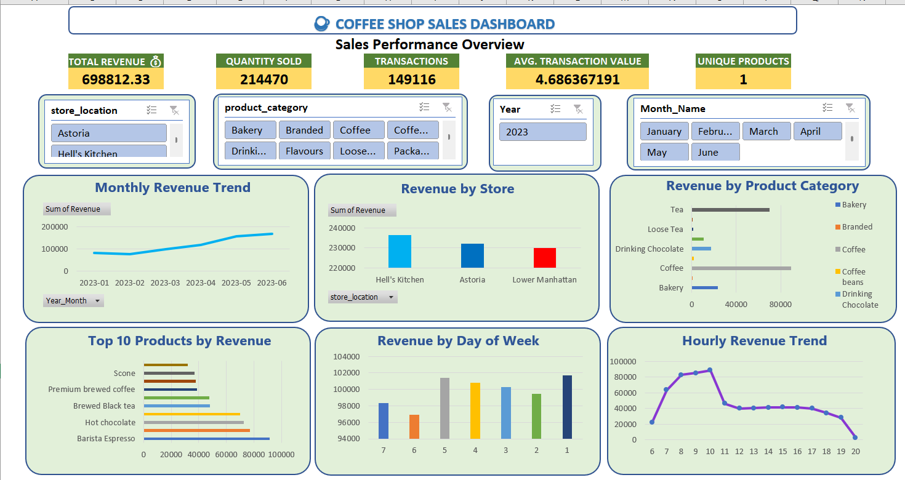

# ☕ Coffee Shop Sales Analysis — Excel

## 📌 Project Overview

This project analyzes coffee shop transaction data using **Microsoft Excel** to understand sales performance, product performance, store performance, customer purchasing behavior, and time-based sales patterns.

The project includes data cleaning, validation, calculated columns, exploratory analysis, KPI analysis, PivotTables, charts, and an interactive Excel dashboard.

---

## 🎯 Project Objectives

The main objectives of this project are:

- Analyze overall sales performance
- Identify top-performing stores
- Identify high-revenue product categories
- Find top-selling products
- Analyze monthly sales trends
- Identify the best-performing days
- Identify peak sales hours
- Compare sales across different time periods
- Build an interactive Excel dashboard
- Generate actionable business recommendations

---

## 🛠️ Tools Used

- Microsoft Excel
- Excel Tables
- Excel Formulas
- PivotTables
- PivotCharts
- Slicers
- Conditional Formatting
- Data Cleaning & Validation

---

## 📊 Dataset

The project uses the **Maven Analytics Coffee Shop Sales dataset**.

**Dataset Source:** Maven Analytics — Coffee Shop Sales

The dataset contains transaction-level sales information including:

- Transaction ID
- Transaction Date
- Transaction Time
- Transaction Quantity
- Store
- Store Location
- Product
- Unit Price
- Product Category
- Product Type
- Product Detail

---

## 🔄 Project Methodology

The project was completed through the following workflow:

1. Data Understanding
2. Data Cleaning & Validation
3. Calculated Columns
4. Exploratory Data Analysis
5. PivotTable Analysis
6. KPI Analysis
7. Charts & Visualization
8. Interactive Dashboard
9. Business Insights & Recommendations

---

## 🧹 Data Cleaning

The dataset was checked for:

- Duplicate transaction IDs
- Missing values
- Negative quantities
- Negative prices
- Zero quantities
- Zero prices
- Invalid dates
- Invalid times
- Category inconsistencies
- Store inconsistencies

The original raw data was preserved separately from the cleaned dataset.

---

## 🧮 Calculated Columns

The following calculated columns were created:

- Revenue
- Year
- Month Number
- Month Name
- Year-Month
- Day Name
- Day Number
- Hour
- Time Period
- Price Band

### Revenue Formula

```excel
=[@transaction_qty]*[@unit_price]
```

### Time Period Formula

```excel
=IF([@Hour]<12,"Morning",IF([@Hour]<17,"Afternoon","Evening"))
```

---

# 📈 KPI Analysis

The dashboard tracks important business KPIs such as:

- 💰 Total Revenue
- 📦 Total Quantity Sold
- 🧾 Total Transactions
- 💵 Average Transaction Value
- 🛒 Average Items per Transaction
- 💲 Average Unit Price
- ☕ Unique Products
- 🏪 Unique Stores

### 📊 KPI Values

| KPI | Value |
|---|---:|
| Total Revenue | `________` |
| Total Quantity Sold | `________` |
| Total Transactions | `________` |
| Average Transaction Value | `________` |
| Average Items per Transaction | `________` |
| Average Unit Price | `________` |
| Unique Products | `________` |
| Unique Stores | `________` |

---

# 📊 Dashboard

The interactive Excel dashboard provides:

- 📅 Monthly Revenue Trend
- 🏪 Revenue by Store
- ☕ Revenue by Product Category
- 🏆 Top 10 Products by Revenue
- 📆 Revenue by Day of Week
- ⏰ Hourly Revenue Trend
- 🌅 Revenue by Time Period
- 🎛️ Interactive Slicers

### Dashboard Preview



---

# 💡 Business Insights

The analysis identifies:

- Highest-performing store
- Highest-revenue product category
- Top revenue-generating products
- Strongest sales day
- Peak sales hour
- Best-performing time period
- Monthly sales patterns

## 📌 Key Findings

- **Total Revenue:** `________`
- **Total Transactions:** `________`
- **Total Quantity Sold:** `________`
- **Best-Performing Store:** `________`
- **Best Product Category:** `________`
- **Top Revenue-Generating Product:** `________`
- **Peak Sales Hour:** `________`
- **Best Sales Day:** `________`
- **Best-Performing Time Period:** `________`

> Actual values and detailed findings are documented in the Excel workbook.

---

# 💼 Business Recommendations

Based on the analysis, the following recommendations can help improve business performance:

1. Maintain adequate inventory for high-revenue products.
2. Optimize staffing during peak sales hours.
3. Analyze successful practices of high-performing stores.
4. Promote complementary products to increase basket size.
5. Use targeted promotions during weaker sales periods.
6. Use monthly sales patterns for inventory and operational planning.

---

# 📁 Project Structure

```text
Coffee-Shop-Sales-Analysis-Excel/
│
├── Data/
│
├── Excel/
│   └── Coffee_Shop_Sales_Analysis.xlsx
│
├── Images/
│   └── Coffee_Shop_Dashboard.png
│
├── Documentation/
│
└── README.md
```

---

# 📌 Key Learning Outcomes

Through this project, I practiced:

- Data cleaning
- Data validation
- Excel formulas
- Calculated columns
- Exploratory Data Analysis
- PivotTables
- PivotCharts
- KPI development
- Interactive slicers
- Data visualization
- Dashboard development
- Business insight generation
- Data-driven recommendations

---

# 🚀 Project Workflow

```text
Raw Sales Data
      ↓
Data Understanding
      ↓
Data Cleaning & Validation
      ↓
Calculated Columns
      ↓
Exploratory Data Analysis
      ↓
PivotTable Analysis
      ↓
KPI Development
      ↓
Charts & Visualization
      ↓
Interactive Dashboard
      ↓
Business Insights
      ↓
Business Recommendations
```

---

# 👨‍💻 About Me

## Vikash Rao

**Aspiring Data Analyst | Business Intelligence Analyst**

📍 Jaunpur, Uttar Pradesh, India

> **Transforming Raw Data into Actionable Business Insights**

I am an aspiring Data Analyst focused on using data analysis and visualization to transform raw data into meaningful business insights.

I work with tools and technologies including **Excel, SQL, Python, Power BI, and Tableau** and enjoy building analytical dashboards, performing exploratory data analysis, and solving business problems using data.

### 💻 Technical Skills

- **Microsoft Excel**
  - Advanced Excel
  - PivotTables
  - PivotCharts
  - Slicers
  - Excel Formulas
  - Dashboard Development

- **SQL**
  - Data Querying
  - Filtering
  - Sorting
  - Aggregations
  - Business Analysis

- **Python**
  - Pandas
  - NumPy
  - Data Cleaning
  - Exploratory Data Analysis

- **Power BI**
  - Dashboard Development
  - Data Visualization
  - Business Intelligence

- **Tableau**
  - Interactive Dashboards
  - Data Visualization
  - Business Insights

- **Data Analytics**
  - Data Cleaning
  - Exploratory Data Analysis
  - Statistics
  - KPI Analysis
  - Data Visualization
  - Business Insights
  - Data Storytelling

---

# 🌐 Connect With Me

### 💼 LinkedIn

[](https://www.linkedin.com/in/vikash-rao-402044336)

### 💻 GitHub

[](https://github.com/vikashrao627-glitch)

### 🌐 Portfolio

[](https://vikashrao-data-portfolio.vercel.app/)

### 📧 Email

**vikashrao625@gmail.com**

---

# 📂 More Projects

Explore more of my Data Analytics projects:

👉 [GitHub Profile](https://github.com/vikashrao627-glitch)

👉 [Portfolio Website](https://vikashrao-data-portfolio.vercel.app/)

---

⭐ If you find this project useful, feel free to explore the repository and connect with me.
